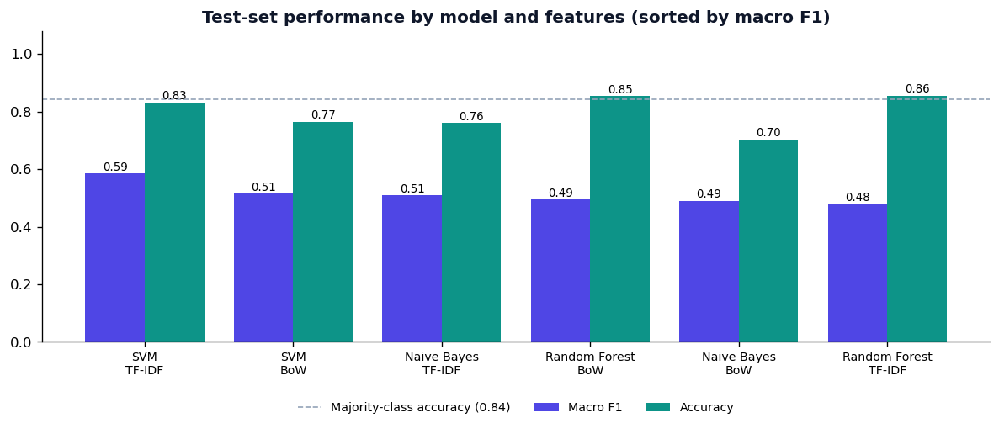
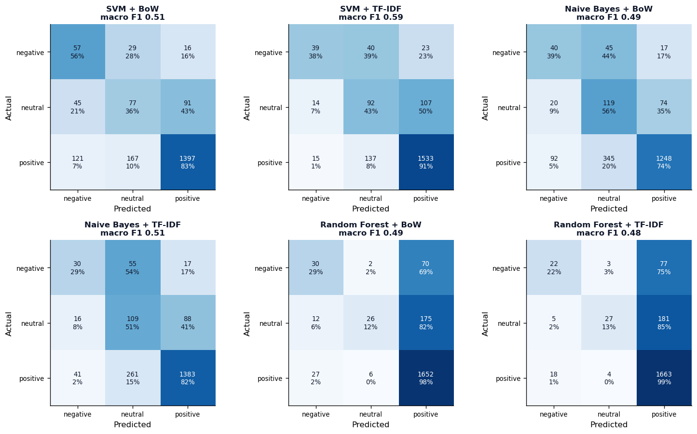
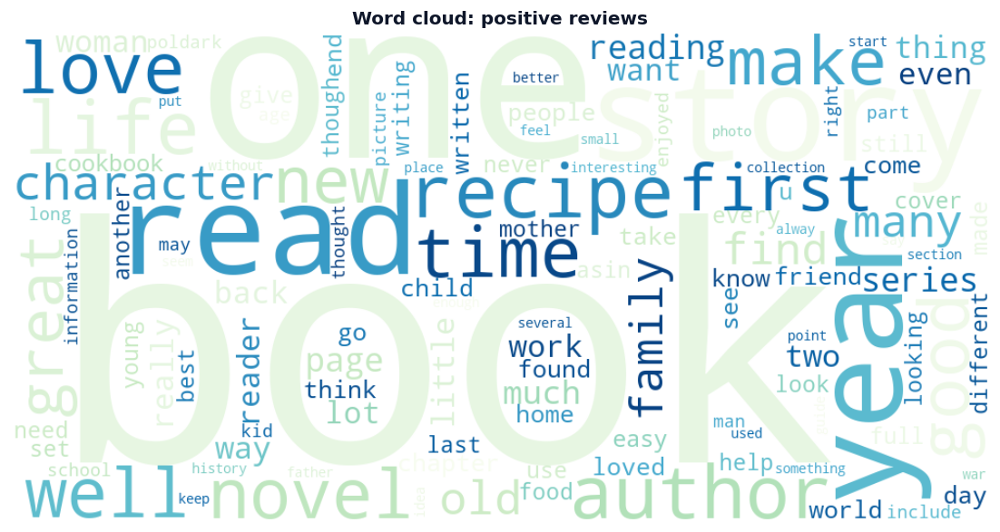
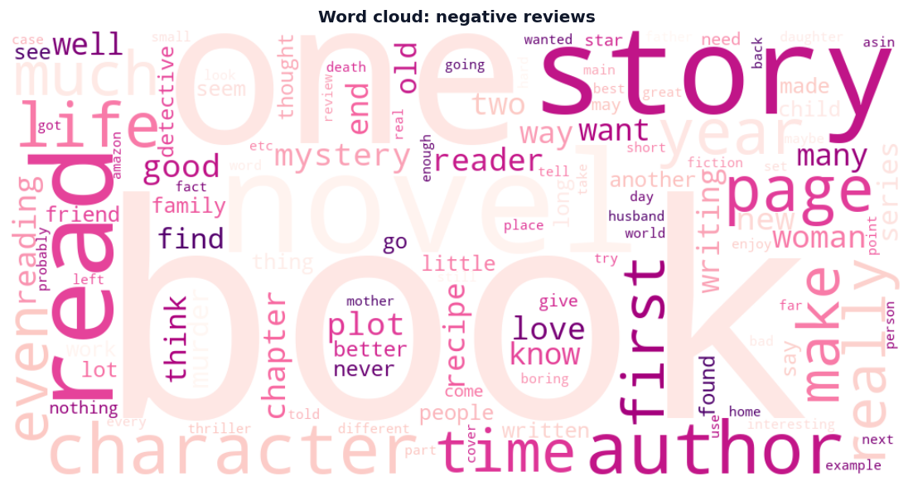
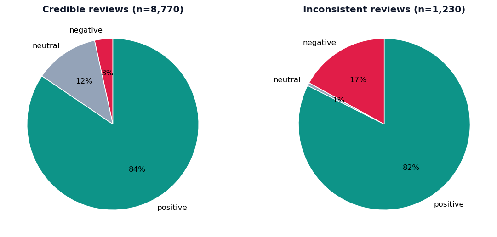

# Consumer Review Intelligence

**Sentiment analysis of Amazon Books reviews for marketing decisions**


My MSc Data Science dissertation at Coventry University asked:

> *How can sentiment analysis of social media data improve the effectiveness of marketing campaigns?*

This repository is the reproducible version of that work. It downloads the first 10,000 reviews
from the Books category of the Amazon Reviews 2023 dataset, cleans and labels them, compares
**Support Vector Machines, Naive Bayes and Random Forest** on **Bag-of-Words and TF-IDF** features,
and separates **credible reviews from inconsistent ones** (for example five stars on a review that
calls the book a waste of time).

## Pipeline

| Stage | What happens | Code |
|---|---|---|
| 1. Data | Streams the first 10,000 lines of `Books.jsonl` from Hugging Face (McAuley Lab) | `data.py` |
| 2. Profile | Row counts, nulls, duplicates, class balance, text length, helpful votes, date range and quality flags | `profile.py` |
| 3. Clean | HTML and URLs removed, emojis to words, contractions and slang expanded (`gr8` to `great`), punctuation and numbers stripped, stop words removed with negations kept, lemmatisation | `preprocess.py` |
| 4. Label | 4-5 stars positive, 3 neutral, 1-2 negative | `preprocess.py` |
| 5. Lexicon scores | VADER compound, positive, neutral and negative scores on the raw text | `features.py` |
| 6. Credibility | Rating vs text contradictions, too-short and generic repeated reviews; `pd.crosstab` of credibility by sentiment | `credibility.py` |
| 7. Explore | Class balance, length, VADER vs stars, word clouds per sentiment, top BoW and TF-IDF terms, bigrams, sentiment by year | `insights.py` |
| 8. Model | 3 classifiers x 2 feature sets, each a vectoriser + classifier pipeline tuned by 3-fold `GridSearchCV` on a stratified 80/20 split | `models.py` |
| 9. Report | Metrics JSON, confusion matrices, Random Forest importances and first tree, this README's results table | `report.py` |

**Model settings.** The SVM grid is the dissertation's: `C` in {0.1, 1, 10, 100}, kernel in {linear,
rbf, poly}, gamma in {scale, auto} and degree in {2, 3}, which is 48 candidates and 144 fits per
feature set. Naive Bayes tunes `alpha`; Random Forest tunes the number of trees, depth and leaf size.
Positive reviews dominate, so models use balanced class weights (or random oversampling with
`--oversample`), and grid search selects on **macro F1** rather than accuracy. A majority-class
baseline is reported alongside, so accuracy can be read in context.

## Results

<!-- RESULTS:START -->
_Latest run: 26 September 2026. 10,000 reviews after cleaning (8,000 train / 2,000 test, stratified). Class mix: positive 84%, neutral 11%, negative 5%._

| Model | Features | Accuracy | Macro precision | Macro recall | Macro F1 | Best parameters |
|---|---|---|---|---|---|---|
| **SVM** | TF-IDF | 0.832 | 0.613 | 0.575 | **0.585** | C=1, degree=2, gamma=scale, kernel=linear |
| SVM | BoW | 0.765 | 0.489 | 0.583 | 0.515 | C=100, degree=2, gamma=auto, kernel=rbf |
| Naive Bayes | TF-IDF | 0.761 | 0.510 | 0.542 | 0.510 | alpha=0.1 |
| Random Forest | BoW | 0.854 | 0.690 | 0.466 | 0.495 | max_depth=60, min_samples_leaf=2, n_estimators=400 |
| Naive Bayes | BoW | 0.704 | 0.476 | 0.564 | 0.490 | alpha=1.0 |
| Random Forest | TF-IDF | 0.856 | 0.716 | 0.443 | 0.480 | max_depth=60, min_samples_leaf=2, n_estimators=400 |
| Majority class | - | 0.843 | 0.281 | 0.333 | 0.305 | - |

- **Best model:** SVM + TF-IDF, macro F1 0.585 and accuracy 0.832, against 0.843 accuracy (macro F1 0.305) for always predicting the majority class.
- **Features:** average macro F1 across the three models is 0.525 with TF-IDF and 0.500 with Bag-of-Words.
- **Credibility:** 12.3% of reviews are flagged inconsistent (817 rating contradicts text, 216 too short, 197 generic repeated text).

Full per-class reports, confusion matrices and tuned parameters: [`reports/metrics.json`](reports/metrics.json) and [`reports/results.md`](reports/results.md).
<!-- RESULTS:END -->

**Reading the results.** Only 5% of reviews are negative and 11% neutral, so always predicting
"positive" already scores 84% accuracy while missing every unhappy customer. SVM with TF-IDF lifts
F1 on negative reviews from 0 to 0.46 and on neutral reviews from 0 to 0.38 while keeping positive
F1 at 0.92, which is why it wins on macro F1 even though its accuracy (0.832) sits just below the
baseline. The random forests post the highest accuracy (0.856) but find only 12-13% of neutral
reviews. TF-IDF beat Bag-of-Words on average across the three models, as in the dissertation.

On credibility, 1,230 of the 10,000 reviews (12.3%) are flagged. Some rating-text contradictions
are genuine (a five-star rating on a critical review), while others are VADER misreading long,
mixed or sarcastic reviews, so the rule works as a screening step before manual review rather than
a verdict.

<p>
  
</p>
<p>
  
</p>
<p>
  
  
</p>
<p>
  
</p>

More charts are in [`reports/figures`](reports/figures), the full tables in
[`reports/results.md`](reports/results.md) and the data profile in
[`reports/data_profile.md`](reports/data_profile.md).

## What the dissertation found

| Model + features | Reported accuracy |
|---|---|
| SVM + TF-IDF (tuned: C = 0.1, linear kernel) | **0.85** (precision 0.85, recall 1.00, F1 0.92) |
| Naive Bayes + TF-IDF | 0.85 |
| Naive Bayes + BoW | 0.60 |
| Random Forest + BoW | 0.50 |
| Random Forest + TF-IDF | 0.50 |

- **Feature representation mattered more than the choice of model.** TF-IDF beat Bag-of-Words for
  every classifier, and the SVM was the most sensitive to that choice.
- **SVM with TF-IDF was the strongest model**, in line with the literature on high-dimensional text.
- **Random Forest struggled with sparse word features**, staying between 0.40 and 0.50.
- **Minority classes were the weak point**, which is why this version adds class weighting,
  stratified splits and macro-averaged metrics.
- **Contradictory reviews are common enough to distort sentiment readings**, so credibility checks
  belong in any sentiment dashboard used for marketing.

The dissertation's comparison used small labelled evaluation samples. This repository re-runs every
combination on the full 10,000 reviews with cross-validated tuning, so the numbers in the Results
section above are the ones to quote. A chapter-by-chapter summary is in
[`docs/dissertation_summary.md`](docs/dissertation_summary.md).

## Credible vs inconsistent reviews

A review is marked **inconsistent** if any of these hold, and **credible** otherwise:

| Rule | Definition |
|---|---|
| Rating contradicts text | 4-5 stars with a VADER compound score of -0.5 or lower, or 1-2 stars with +0.5 or higher |
| Too short | Fewer than 3 words ("ok", "Good") |
| Generic repeated text | The same text posted for 3 or more different books |

The report compares the sentiment mix and helpful votes of the two groups and lists the most-voted
contradictory reviews.

## Using this for marketing

- **Campaign tracking:** a falling share of positive reviews after a launch or price change is an
  early warning, well before sales data arrives.
- **Messaging:** the most frequent terms and bigrams in positive reviews show what readers value;
  the negative ones show what to fix or stop promising.
- **Targeting:** customers who write positive reviews suit loyalty and referral campaigns; negative
  reviewers are candidates for service recovery.
- **Reputation:** inconsistent and generic reviews should be filtered out before sentiment is
  reported, so one-star-worthy complaints hidden behind five-star ratings are not missed.

## Run it

```bash
python -m venv .venv && source .venv/bin/activate
pip install -r requirements.txt

python run_pipeline.py            # full grids, as in the dissertation
python run_pipeline.py --quick    # linear SVM and smaller grids, a few minutes
python -m pytest -q               # unit tests

python predict.py "Beautifully written, I could not put it down."
```

The first run downloads the NLTK stop words and WordNet data and streams the reviews into
`data/raw/`. The full SVM grid (rbf and poly kernels included) is the slowest step; `--jobs` sets
the number of CPU cores used. Other options: `--n` for a different sample size, `--input` for your
own CSV or JSONL file with `rating` and `text` columns, `--oversample` for random oversampling.

## Project structure

```text
run_pipeline.py          end-to-end run
predict.py               score new reviews with the saved best model
src/review_intel/
    config.py            paths, data source, split and grid settings
    data.py              download, load, anonymise
    profile.py           data profile and quality flags
    preprocess.py        text cleaning and sentiment labels
    features.py          BoW / TF-IDF vectorisers, VADER scores, top terms
    credibility.py       credible vs inconsistent rules and summaries
    insights.py          exploratory charts
    models.py            pipelines, grids, training and evaluation
    report.py            charts, metrics.json, results.md, README results block
tests/                   cleaning, labelling, credibility and report tests
reports/                 data profile, results tables, metrics and figures
docs/                    dissertation summary
```

## Data and ethics

- **Dataset:** Amazon Reviews 2023, McAuley Lab, UC San Diego (Hou et al., 2024,
  *Bridging Language and Items for Retrieval and Recommendation*, arXiv:2403.03952). Only the first
  10,000 Books reviews are used, matching the dissertation.
- Reviewer IDs are used only to count duplicates in the data profile and are then dropped. Raw data
  is downloaded at run time and is not stored in this repository.
- The study received ethical approval from Coventry University (low risk).

## Limitations and next steps

- Star ratings are a proxy for sentiment: some reviewers rate the delivery or the seller, not the book.
- Sarcasm and mixed opinions ("just great...") remain hard for word-count features.
- Next: fine-tune a transformer (DistilBERT or RoBERTa) on the same split, add aspect-based sentiment
  (plot, characters, price, delivery), and track sentiment for a product over time.

---

MSc Data Science dissertation, Coventry University (module 7150CEM), supervised by
Prof. Roohi Barzamini. Author: Manoj Ram Mopati.
