# Results

_Latest run: 26 September 2026. 10,000 reviews after cleaning (8,000 train / 2,000 test, stratified). Class mix: positive 84%, neutral 11%, negative 5%._

| Model | Features | Accuracy | Macro precision | Macro recall | Macro F1 | Best parameters |
|---|---|---|---|---|---|---|
| **SVM** | TF-IDF | 0.832 | 0.613 | 0.575 | **0.585** | C=1, degree=2, gamma=scale, kernel=linear |
| SVM | BoW | 0.765 | 0.489 | 0.583 | 0.515 | C=100, degree=2, gamma=auto, kernel=rbf |
| Naive Bayes | TF-IDF | 0.761 | 0.510 | 0.542 | 0.510 | alpha=0.1 |
| Random Forest | BoW | 0.854 | 0.690 | 0.466 | 0.495 | max_depth=60, min_samples_leaf=2, n_estimators=400 |
| Naive Bayes | BoW | 0.704 | 0.476 | 0.564 | 0.490 | alpha=1.0 |
| Random Forest | TF-IDF | 0.856 | 0.716 | 0.443 | 0.480 | max_depth=60, min_samples_leaf=2, n_estimators=400 |
| Majority class | - | 0.843 | 0.281 | 0.333 | 0.305 | - |

- **Best model:** SVM + TF-IDF, macro F1 0.585 and accuracy 0.832, against 0.843 accuracy (macro F1 0.305) for always predicting the majority class.
- **Features:** average macro F1 across the three models is 0.525 with TF-IDF and 0.500 with Bag-of-Words.
- **Credibility:** 12.3% of reviews are flagged inconsistent (817 rating contradicts text, 216 too short, 197 generic repeated text).

Full per-class reports, confusion matrices and tuned parameters: [`reports/metrics.json`](metrics.json) and [`reports/results.md`](results.md).

## Per-class F1 (test set)

| Model | Features | negative | neutral | positive |
|---|---|---|---|---|
| Majority class | - | 0.000 | 0.000 | 0.915 |
| SVM | BoW | 0.351 | 0.317 | 0.876 |
| SVM | TF-IDF | 0.459 | 0.382 | 0.916 |
| Naive Bayes | BoW | 0.315 | 0.330 | 0.825 |
| Naive Bayes | TF-IDF | 0.317 | 0.342 | 0.872 |
| Random Forest | BoW | 0.351 | 0.211 | 0.922 |
| Random Forest | TF-IDF | 0.299 | 0.219 | 0.922 |

## Credible vs inconsistent reviews

| Group | Reviews | negative | neutral | positive |
|---|---|---|---|---|
| Credible | 8,770 | 3.4% | 12.1% | 84.5% |
| Inconsistent | 1,230 | 17.0% | 0.6% | 82.4% |

| Group | Mean helpful votes | Share with at least one vote |
|---|---|---|
| Credible | 3.46 | 47.6% |
| Inconsistent | 2.10 | 40.0% |

### Most-voted contradictory reviews

| Stars | VADER | Helpful votes | Excerpt |
|---|---|---|---|
| 1 | +0.99 | 162 | What a HUGE disappointment. They have three basic "sweet cream bases".... best, good, last resort (as they describe them). Sounds reasonable right? EXCEPT that... |
| 5 | -0.79 | 125 | I love reading about famous crimes, medical oddities, and cases solved by forensics. This book has them all, and is every bit as entertainingly well-written as... |
| 5 | -0.82 | 81 | September 1940 England is going it alone under daily bombardment from the Germans during the Blitz. I have been an avid reader of this series and was delighted... |
| 2 | +0.93 | 66 | What a disappointment--from Interweave Press, of all publishers! THE KNITTER’S DICTIONARY: KNITTING KNOW-HOW FROM A TO Z is a small, handbook-sized dictionary o... |
| 5 | -0.92 | 64 | Entertaining account of the expeditions of two world-renowned cavers (Bill Stone, Alexander Klimchouk) that explored deep supercaves in Mexico (Cheve, Huautla)... |
| 4 | -0.63 | 56 | A moving YA novel that tells the sad tale of Cynthia Ann Parker, a Texan who was abducted by the Comanche tribe as an nine-year-old in 1836. The Comanches kille... |

## Top terms

| Rank | Bag-of-Words (count) | TF-IDF (total weight) |
|---|---|---|
| 1 | book (19,359) | book (440.1) |
| 2 | not (15,829) | not (331.0) |
| 3 | one (6,940) | read (247.7) |
| 4 | story (6,339) | great (239.6) |
| 5 | read (5,419) | story (234.2) |
| 6 | like (5,189) | good (227.3) |
| 7 | year (5,160) | love (222.2) |
| 8 | author (4,458) | one (206.0) |
| 9 | life (4,298) | year (186.2) |
| 10 | recipe (4,237) | like (186.1) |
| 11 | novel (4,195) | author (165.8) |
| 12 | would (4,108) | would (159.8) |
| 13 | time (3,918) | well (156.3) |
| 14 | good (3,915) | time (150.2) |
| 15 | love (3,872) | reading (146.3) |
| 16 | well (3,650) | character (144.3) |
| 17 | make (3,521) | life (142.6) |
| 18 | first (3,348) | novel (141.8) |
| 19 | also (3,313) | old (139.6) |
| 20 | character (3,313) | really (136.7) |

**Top bigrams, negative reviews:** not like, year old, book not, mystery thriller, amazon scale, official amazon, main character, star not, like official, would not

**Top bigrams, neutral reviews:** year old, book not, well written, star okay, amazon scale, official amazon, okay official, could not, not know, main character

**Top bigrams, positive reviews:** year old, book not, well written, ross poldark, read book, could not, new york, main character, year ago, first book

## Figures

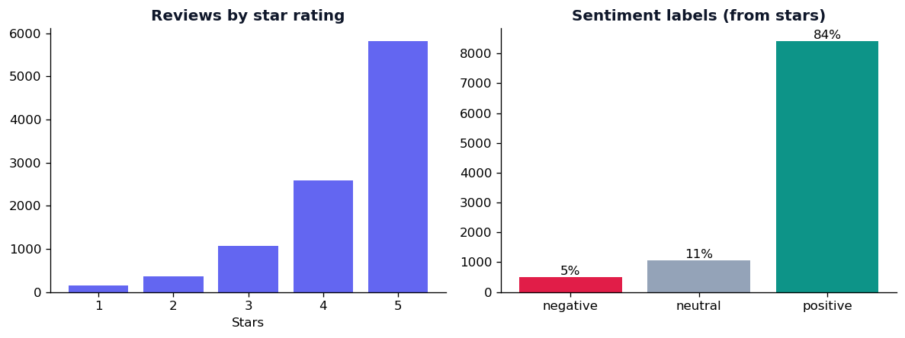

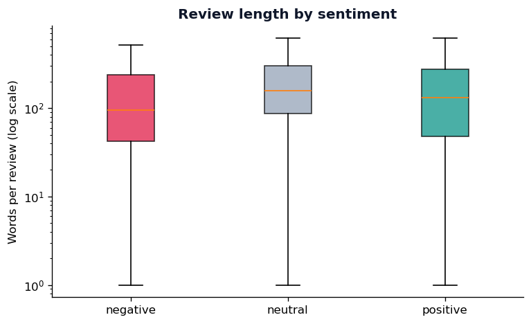

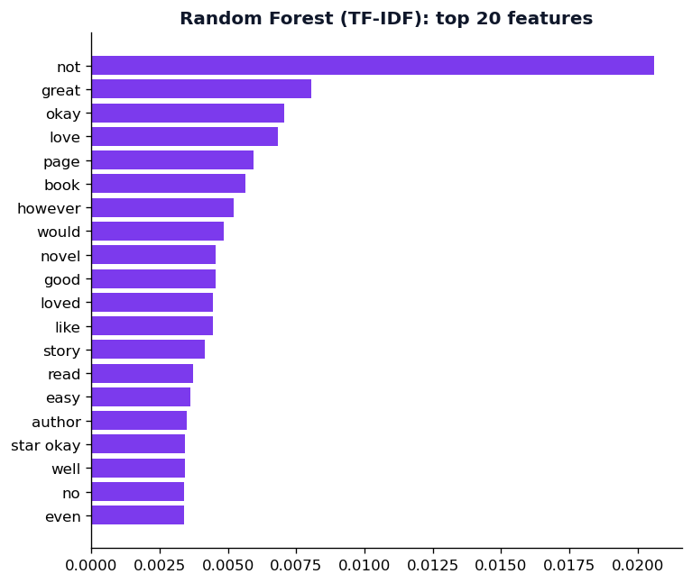
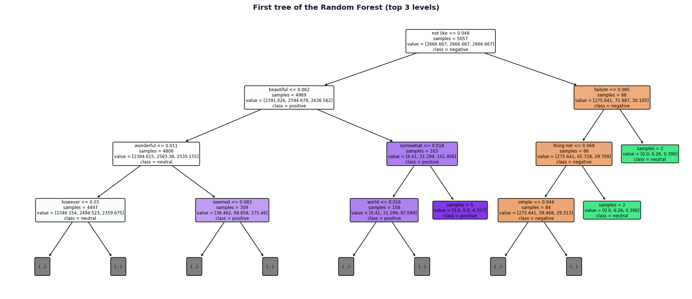
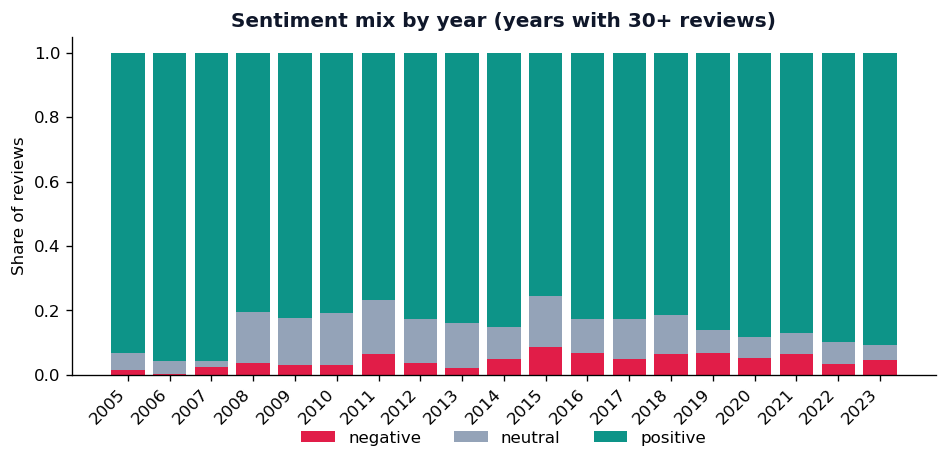
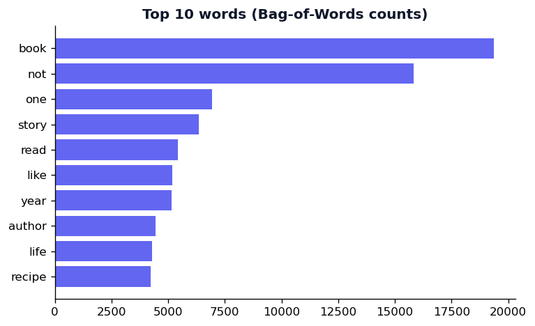
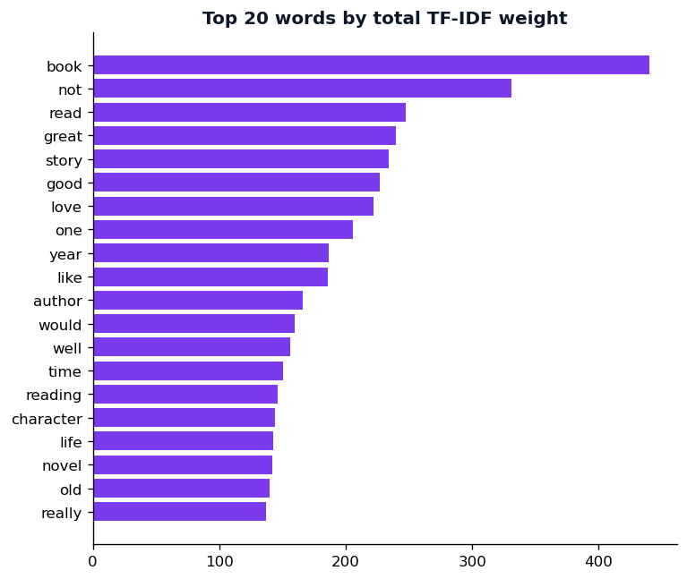
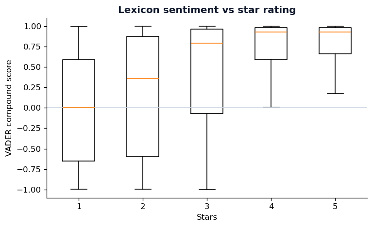
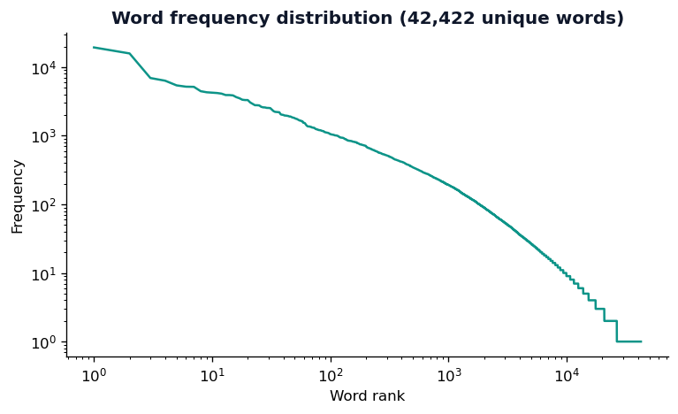
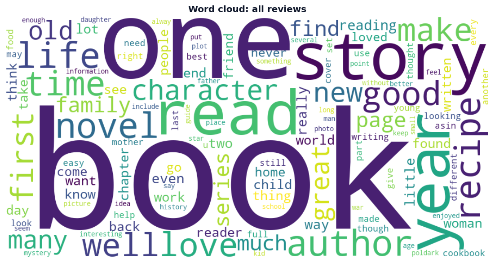

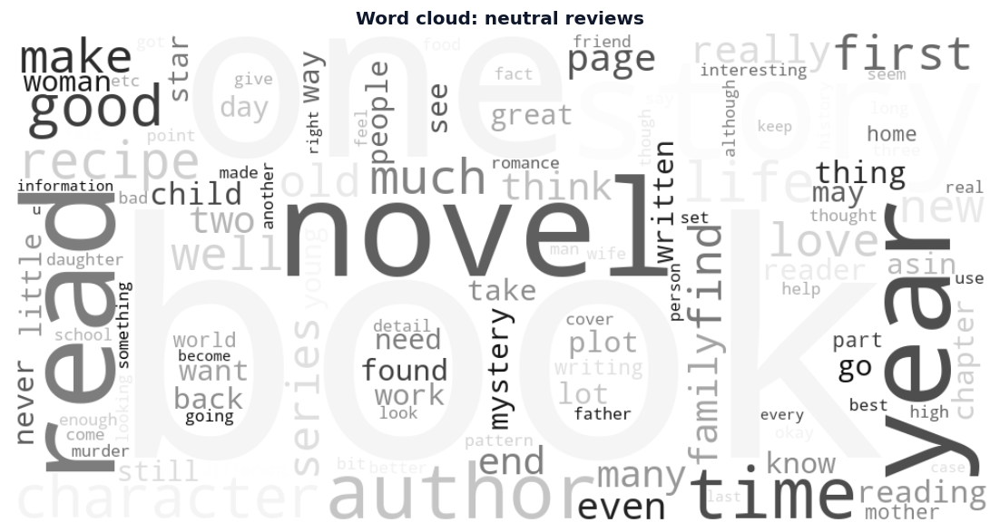

